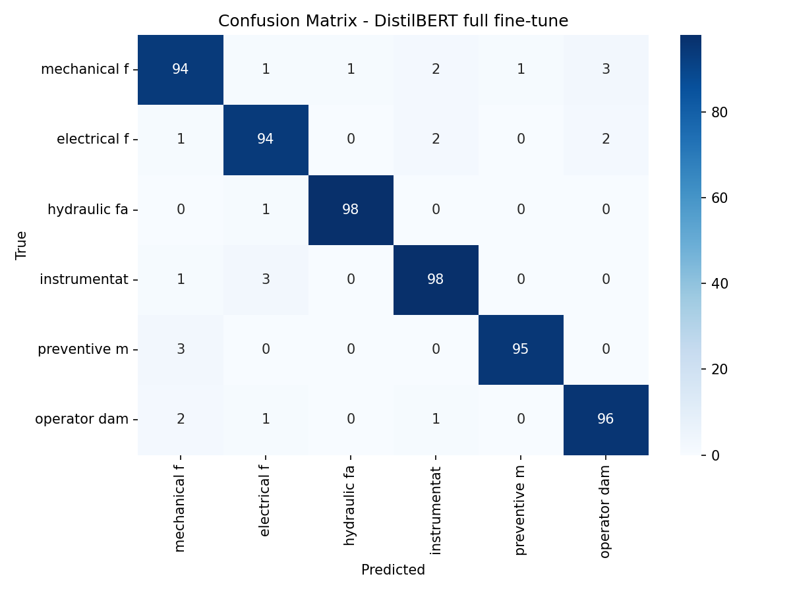
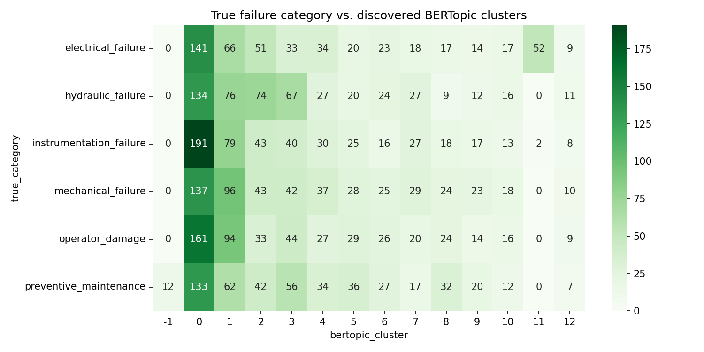

# Maintenance Work Order NLP

> **The deepest project in the portfolio — three distinct flavors of LLM use in one pipeline: LLM as data engineer (ETL), LLM as model (PEFT fine-tune), and LLM as application target (semantic search).**

[](https://www.python.org/)
[](https://huggingface.co/)
[](https://github.com/huggingface/peft)
[](https://fastapi.tiangolo.com/)

Every industrial company generates thousands of maintenance work orders per year — free text written by technicians describing what broke, what they did, and what parts were used. This data is almost never analyzed systematically. This project builds the full pipeline: extract structured data from messy text, classify failures by type, discover recurring patterns, and retrieve similar past cases.

**Domain credibility:** I've written real maintenance work orders across HVAC (Rheem), subsea (Centurion), and manufacturing (Daikin/Baker Hughes). The synthetic corpus reflects actual failure taxonomy and field vocabulary.

**Live demo:** [maintenance-work-order-nlp.vercel.app](https://maintenance-work-order-nlp.vercel.app)  
**API docs:** [maintenance-nlp-api.onrender.com/docs](https://maintenance-nlp-api.onrender.com/docs)  
*(API runs on Render's free tier — the first request after an idle period takes ~30–60 s to wake the server)*

**Current status:** all metrics in this README are measured, not projected — ETL extraction (rule-based / LLM / hybrid), classification (TF-IDF / DistilBERT / LoRA), clustering, and similarity search. Every number reproduces with `scripts/run_local_pipeline.py` and `scripts/run_etl_eval.py`. Remaining: the stretch QLoRA notebook (Colab GPU) and live deployment links.

---

## Three Flavors of LLM Use (What Makes This Different)

```
1. LLM as DATA ENGINEER
   Messy free text → structured records via GPT-4o-mini + Pydantic schema
   "replaced front bearing on pump P-104" → {equipment: "P-104", part: "bearing", action: "replace"}

2. LLM as MODEL
   DistilBERT full fine-tune → LoRA fine-tune (1.1% of parameters, 94.4% vs 95.9% F1)
   QLoRA on 7B decoder model on free Colab GPU (stretch)

3. LLM as APPLICATION TARGET
   sentence-transformers embeddings → cosine similarity search
   "describe a new failure → find 3 most similar past cases"
```

---

## Pipeline Architecture

```
data/synthetic_generator.py
  → 3,000 work orders × 6 failure categories
  → Parallel ground-truth structured fields (for ETL evaluation)
        ↓
notebooks/01_eda.ipynb           Text length, vocabulary, class balance
        ↓
notebooks/02_llm_etl_extraction.ipynb   ← KEY NOTEBOOK
  Rule-based regex vs. GPT-4o-mini vs. Hybrid → per-field F1 + cost table
  src/etl_extractor.py — pluggable backends
        ↓
notebooks/03_preprocessing.ipynb    NLTK cleaning + TF-IDF baseline
        ↓
notebooks/04_classification.ipynb   TF-IDF → DistilBERT full fine-tune
        ↓
notebooks/05_lora_finetune.ipynb    LoRA on DistilBERT — 1.1% params, 2.8 MB adapter
notebooks/06_qlora_finetune.ipynb   QLoRA on 7B model (Colab stretch)
        ↓
notebooks/07_clustering.ipynb       BERTopic failure pattern discovery
notebooks/08_similarity.ipynb       sentence-transformers cosine search
        ↓
api/main.py (FastAPI → Render)
  POST /classify → {category, confidence, similar_cases}
        ↓
frontend/ (Vanilla JS → Vercel)
  Text area input → category badge + top 3 similar past failures
```

---

## ETL Extraction Results

Per-field extraction accuracy (substring match), measured on a 100-record sample (`random_state=42`). Fields the noise layer removed from a record's text are excluded from that record's evaluation, so extractors are never penalized for information that isn't there.

| Method | Equipment tag | Failure mode | Parts | Root cause | Category | LLM calls | Latency avg |
|--------|--------------|--------------|-------|-----------|----------|-----------|-------------|
| Rule-based regex | 82% | 13% | 40% | 42% | 50% | 0% | <1 ms |
| LLM-only (GPT-4o-mini) | **99%** | **70%** | **80%** | **77%** | **72%** | 100% | ~1.1 s |
| Hybrid (regex → LLM if confidence < 0.7) | 96% | 23% | 58% | 58% | 59% | **44%** | ~0.5 s |

*The regex baseline holds up on structured fields (equipment tags follow a `XX-NNN` pattern) but collapses on long-tail narrative fields — typos, shorthand, and paraphrased failure descriptions defeat keyword matching. The LLM lifts failure-mode accuracy 5×.*

*The hybrid's most interesting result is a negative one: it cut API calls by 56% but kept far less than 56% of the LLM's uplift, because the rule-based confidence score is miscalibrated — the regex extractor is often confidently wrong on noisy text, so the records that most needed escalation never got it. A production version needs a better escalation signal than extractor self-confidence (e.g., field-completeness checks or a small calibrated classifier). Measured on the 100-record sample; cost for LLM-only extraction is roughly $0.10–0.15 per 1K records at GPT-4o-mini prices.*

---

## PEFT Comparison

Macro F1 on a held-out 600-record test set (stratified 80/20 split, seed 42). Trained on Apple Silicon (MPS), 4 epochs each.

| Approach | F1 | Trainable params | % of model | Train minutes | Artifact size |
|----------|----|-----------------|------------|---------------|---------------|
| TF-IDF + Logistic Regression (baseline) | 93.5% | 17K | n/a | <0.1 | 0.4 MB |
| DistilBERT full fine-tune | **95.9%** | 67.0M | 100% | 6.1 | 256 MB |
| DistilBERT + LoRA (r=8) | **94.4%** | 743K | **1.1%** | 3.9 | **2.8 MB** |
| QLoRA on 7B decoder (stretch) | — | — | <1% | — | — |

*With ~2% label noise injected by the generator, the effective ceiling is ≈98% — so the transformers' 1–2.4 point gain over TF-IDF is real signal, not noise-fitting. LoRA recovers most of the full fine-tune's gain while updating 1.1% of parameters, training 1.6× faster, and producing a 2.8 MB adapter instead of a 256 MB model — which is why the adapter ships in this repo and the full model doesn't (it also exceeds GitHub's 100 MB file limit; regenerate it with `scripts/run_local_pipeline.py`).*



---

## Clustering: What the Embeddings Actually Organize By

BERTopic (MiniLM embeddings + HDBSCAN) discovered 13 clusters — but **not the 6 failure categories**. It organized the corpus by *equipment type* (pump, fan, boiler, conveyor, valve, compressor clusters) and by *writing style* (terse one-liners formed their own cluster). That's a finding, not a failure: unsupervised structure follows the strongest signal in the embedding space, which here is equipment vocabulary, not failure semantics — exactly why the supervised classifier earns its keep.



---

## Dataset

3,000 synthetic maintenance work orders generated by `data/synthetic_generator.py` with domain knowledge from 12 years of industrial engineering experience.

| Failure Category | Description | Example equipment |
|-----------------|-------------|------------------|
| Mechanical failure | Bearing wear, seal leak, shaft misalignment | Pumps, compressors, motors |
| Electrical failure | Motor burnout, sensor fault, wiring issue | Control panels, drives, sensors |
| Hydraulic failure | Pressure loss, valve malfunction, fluid contamination | Hydraulic systems, actuators |
| Instrumentation failure | Transmitter drift, thermocouple failure | Field instruments, transmitters |
| Preventive maintenance | Scheduled inspection, lubrication, filter change | All equipment types |
| Operator damage | Impact damage, improper operation | Any equipment |

Each work order: `work_order_id`, `date`, `equipment_tag`, `technician_id`, `text` (terse one-liners to ~120 words), `labor_hours`, `parts_used` + ground-truth `failure_category`, `failure_mode`, `parts_replaced`, `root_cause`.

**Note on synthetic data:** All records are synthetic, generated with deep domain expertise (real failure taxonomy, realistic technical vocabulary, authentic abbreviations). Disclosed clearly here and in the notebooks.

**Realism layer:** real CMMS text is messy, so the generator injects calibrated noise — character-level typos, technician shorthand (`repl`, `brg`, `RTS`), vague generic observations, overlapping symptoms across confusable categories, terse one-liners that omit fields entirely, and ~2% miscategorized labels (the noise ceiling any classifier faces in production data). Without this layer every classifier scores a meaningless 100%; with it, the baseline-vs-transformer comparison measures something real. When noise removes a field from the text, the ETL ground truth is nulled for that record so extraction metrics stay fair.

---

## Tech Stack

| Layer | Tool |
|-------|------|
| Text preprocessing | NLTK + spaCy |
| Baseline NLP | TF-IDF + scikit-learn |
| LLM ETL extraction | OpenAI GPT-4o-mini + Pydantic structured output |
| Full fine-tune | HuggingFace Transformers — DistilBERT |
| PEFT fine-tune | HuggingFace PEFT — LoRA / QLoRA + bitsandbytes |
| Clustering | BERTopic (transformer-based topic modeling) |
| Similarity search | sentence-transformers + cosine similarity |
| API | FastAPI on Render |
| Frontend | Vanilla HTML/CSS/JS on Vercel |

---

## Setup

```bash
git clone https://github.com/aalias01/maintenance-work-order-nlp
cd maintenance-work-order-nlp

conda env create -f environment.yml
conda activate maintenance-nlp
python -m ipykernel install --user --name maintenance-nlp --display-name "maintenance-nlp"

# Set up API key for LLM ETL track
cp .env.example .env
# Edit .env — add your OPENAI_API_KEY
# Cost estimate for notebook 02: ~$0.30 for 3,000 records at full LLM mode

# Generate synthetic corpus (runs immediately — no downloads needed)
python data/synthetic_generator.py

# Reproduce every metric in this README with one command (~20-40 min on a laptop):
python scripts/run_local_pipeline.py        # TF-IDF, DistilBERT, LoRA, BERTopic, embeddings
python scripts/run_etl_eval.py --mode rule_based --report   # ETL eval (add --mode llm/hybrid with an API key)

# Or explore step by step in the notebooks: 01 → 02 → 03 → 04 → 05 → 07 → 08
# (06 QLoRA requires Colab GPU — see notebook for Colab setup instructions)
```

### Local API + Frontend Smoke Test

After notebooks 03 and 08 have saved the classifier and embedding artifacts:

```bash
uvicorn api.main:app --reload
```

Open `frontend/index.html` in a browser. The frontend expects the API at `http://localhost:8000` until `frontend/app.js` is updated with the deployed Render URL.

---

## Interview Context

1. **Domain data creation:** *"I've written real maintenance work orders professionally. The synthetic data reflects actual failure taxonomy — bearing degradation modes, seal failure patterns, hydraulic pressure signatures — plus a calibrated noise layer: typos, technician shorthand, terse one-liners, overlapping symptoms, and 2% mislabeled records. My first version was too clean and every model scored 100%; making the data hard enough to be worth modeling was itself the data-engineering lesson."*

2. **LLM ETL (the production story):** *"Real CMMS data arrives as messy free text. I built three extractors — regex baseline, pure GPT-4o-mini with Pydantic structured output, and a hybrid that runs regex first and escalates low-confidence records to the LLM. The LLM lifted failure-mode extraction from 13% to 70%. But the hybrid taught me the real lesson: it cut API calls 56% yet lost most of the LLM's gain, because the regex extractor's self-reported confidence was miscalibrated — it was confidently wrong on exactly the records that needed escalation. I'd ship the hybrid pattern, but with a learned escalation gate, not extractor self-confidence."*

3. **LoRA vs. full fine-tune:** *"LoRA updated 1.1% of DistilBERT's parameters and landed within 1.5 F1 points of the full fine-tune — on a corpus with a ~98% noise ceiling, that's most of the available gain. The artifact difference is the real story: a 2.8 MB adapter versus a 256 MB model. The full model doesn't even fit under GitHub's file limit; the adapter ships in the repo. That's deployment economics, measured."*

4. **BERTopic discovery:** *"The honest finding: BERTopic didn't recover my 6 failure categories — it clustered by equipment type and even by writing style (terse one-liners formed their own cluster). Unsupervised structure follows the strongest embedding signal, which was equipment vocabulary, not failure semantics. Knowing what embeddings actually organize by is exactly what tells you when you need labels."*

5. **Why this project matters:** *"Every company with a CMMS has thousands of unstructured work orders sitting in a database nobody reads. This pipeline makes them searchable, classifiable, and analyzable — it's a direct productivity tool for maintenance engineers."*

---

*Built by [Alvin Alias](https://github.com/aalias01) — MS Data Science, University of Washington · 12 years industrial engineering (HVAC, subsea, manufacturing)*
