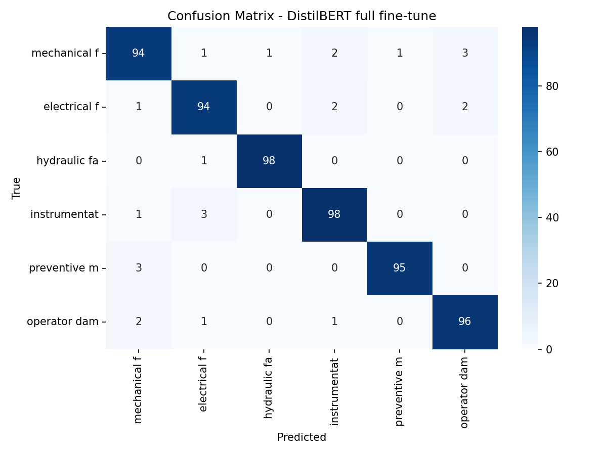
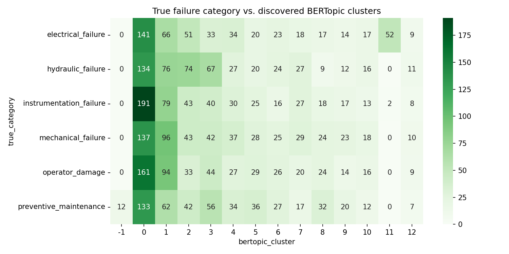

# Maintenance Work Order NLP

One pipeline, three distinct uses of language models: offline structured-extraction experiments, a LoRA classifier reaching 94.4% macro F1 while training 1.1% of parameters, and semantic search over past cases. All text is synthetic and shares generator templates, so the results measure this controlled benchmark rather than transfer to real CMMS data.

[](https://www.python.org/)
[](https://github.com/aalias01/maintenance-work-order-nlp/actions/workflows/ci.yml)
[](https://huggingface.co/)
[](https://github.com/huggingface/peft)
[](https://fastapi.tiangolo.com/)
[](LICENSE)

**[Live demo](https://workorders.alvinalias.com)** | **[API docs](https://alvinalias-portfolio-ml-api.hf.space/maintenance/docs)**

The API is mounted at `/maintenance` in a shared Hugging Face CPU Space. After extended inactivity, the first request can take a moment while the Space wakes and loads the ONNX models.

See [models/MODEL_CARD.md](models/MODEL_CARD.md) for the classifier, extraction, retrieval, data, and limitation notes.

## Why

Industrial companies generate thousands of maintenance work orders a year: free text written by technicians describing what broke, what they did, and what parts they used. That data is almost never analyzed systematically. This pipeline extracts structured records from the text, classifies failures by type, discovers recurring patterns, and retrieves similar past cases. I've written real work orders across HVAC (Rheem), subsea (Centurion), and manufacturing (Daikin/Baker Hughes); the corpus and its failure taxonomy come from that experience.

Every metric below is measured, reproducible with `scripts/run_local_pipeline.py` and `scripts/run_etl_eval.py`. The one unfinished piece is the stretch QLoRA notebook (needs a Colab GPU).

## The three LLM roles

```
1. LLM as DATA ENGINEER
   messy free text -> structured records via GPT-4o-mini + Pydantic schema
   "replaced front bearing on pump P-104" -> {equipment: "P-104", part: "bearing", action: "replace"}

2. LLM as MODEL
   DistilBERT full fine-tune vs LoRA fine-tune (1.1% of params: 94.4% vs 95.9% F1)
   QLoRA on a 7B decoder on free Colab GPU (stretch, in progress)

3. LLM as APPLICATION TARGET
   sentence-transformers embeddings -> cosine similarity search
   describe a new failure -> find the 3 most similar past cases
```

## ETL extraction results

Per-field extraction accuracy (substring match) on a 100-record sample (`random_state=42`). Fields the noise layer removed from a record's text are excluded from that record's evaluation, so extractors aren't penalized for information that isn't there.

| Method | Equipment tag | Failure mode | Parts | Root cause | Category | LLM calls | Latency avg |
|--------|--------------|--------------|-------|-----------|----------|-----------|-------------|
| Rule-based regex | 82% | 13% | 40% | 42% | 50% | 0% | <1 ms |
| LLM-only (GPT-4o-mini) | **99%** | **70%** | **80%** | **77%** | **72%** | 100% | ~1.1 s |
| Hybrid (regex, escalate if confidence < 0.7) | 96% | 23% | 58% | 58% | 59% | 44% | ~0.5 s |

The regex baseline holds up on structured fields (equipment tags follow an `XX-NNN` pattern) but collapses on narrative fields, where typos, shorthand, and paraphrased descriptions defeat keyword matching. The LLM takes failure-mode accuracy from 13% to 70%.

The hybrid's most useful result is a negative one. It cut API calls by 56% but kept far less than 56% of the LLM's uplift, because the regex extractor's confidence score is miscalibrated: it is often confidently wrong on noisy text, so the records that most needed escalation never got it. A production version needs a better escalation signal than extractor self-confidence, such as field-completeness checks or a small calibrated classifier. Cost for LLM-only extraction is roughly $0.10 to $0.15 per 1K records at GPT-4o-mini prices.

## PEFT comparison

Macro F1 on a held-out 600-record test set (stratified 80/20 split, seed 42). Trained on Apple Silicon (MPS), 4 epochs each.

| Approach | F1 | Trainable params | % of model | Train minutes | Artifact size |
|----------|----|-----------------|------------|---------------|---------------|
| TF-IDF + logistic regression (baseline) | 93.5% | 27K | n/a | <0.1 | 0.4 MB |
| DistilBERT full fine-tune | **95.9%** | 67.0M | 100% | 6.1 | 256 MB |
| DistilBERT + LoRA (r=8) | **94.4%** | 743K | **1.1%** | 3.9 | **2.8 MB** |
| QLoRA on 7B decoder (stretch) | pending | | <1% | | |

The generator injects about 2% label noise, but that does not create an exact 98% macro-F1 ceiling. On this random row split, LoRA recovers most of the full fine-tune's score while updating 1.1% of parameters and producing a 2.8 MB adapter instead of a 256 MB model. Rows share generator templates, so a site-held-out or template-held-out evaluation would be a stronger generalization test.



## Clustering: what the embeddings organize by

BERTopic (MiniLM embeddings + HDBSCAN) found 13 clusters, and they are not the 6 failure categories. The corpus organized by equipment type (pump, fan, boiler, conveyor, valve, compressor) and by writing style (terse one-liners formed their own cluster). Unsupervised structure follows the strongest signal in the embedding space, which here is equipment vocabulary rather than failure semantics. That finding is exactly why the supervised classifier earns its keep.



## Dataset

3,000 synthetic work orders from `data/synthetic_generator.py`. All records are synthetic, disclosed here and in the notebooks; the failure taxonomy, technical vocabulary, and abbreviations come from 12 years of industrial engineering.

| Failure category | Examples | Equipment |
|-----------------|----------|-----------|
| Mechanical | Bearing wear, seal leak, shaft misalignment | Pumps, compressors, motors |
| Electrical | Motor burnout, sensor fault, wiring | Panels, drives, sensors |
| Hydraulic | Pressure loss, valve malfunction, contamination | Hydraulic systems, actuators |
| Instrumentation | Transmitter drift, thermocouple failure | Field instruments |
| Preventive maintenance | Inspection, lubrication, filter change | All types |
| Operator damage | Impact damage, improper operation | Any |

Real CMMS text is messy, so the generator injects calibrated noise: character-level typos, technician shorthand (`repl`, `brg`, `RTS`), vague observations, overlapping symptoms across confusable categories, terse one-liners that omit fields, and ~2% miscategorized labels. Without this layer every classifier scores a meaningless 100%. When noise removes a field from the text, the ETL ground truth is nulled for that record so extraction metrics stay fair.

## Pipeline

```
data/synthetic_generator.py        3,000 work orders + parallel ground truth
notebooks/01_eda.ipynb             text length, vocabulary, class balance
notebooks/02_llm_etl_extraction.ipynb   rule-based vs GPT-4o-mini vs hybrid (key notebook)
notebooks/03_preprocessing.ipynb   NLTK cleaning + TF-IDF baseline
notebooks/04_classification.ipynb  TF-IDF -> DistilBERT full fine-tune
notebooks/05_lora_finetune.ipynb   LoRA on DistilBERT
notebooks/06_qlora_finetune.ipynb  QLoRA on 7B (Colab, stretch)
notebooks/07_clustering.ipynb      BERTopic pattern discovery
notebooks/08_similarity.ipynb      sentence-transformers cosine search
api/main.py                        POST /classify -> {category, confidence, similar_cases}
frontend/                          reading desk -> category, confidence, extracted fields, closest past cases
```

## Tech stack

Python 3.11, NLTK + spaCy, scikit-learn (TF-IDF baseline), OpenAI GPT-4o-mini with Pydantic structured output, HuggingFace Transformers + PEFT (LoRA/QLoRA, bitsandbytes), BERTopic, sentence-transformers (all-MiniLM-L6-v2), FastAPI on a shared Hugging Face Docker Space, vanilla JS on Vercel. The deployed API is torch-free: the LoRA classifier and MiniLM embedder are exported once to int8 ONNX (`scripts/build_onnx.py`) and served with onnxruntime in the shared gateway.

`models/corpus_meta.json` restores similar-case retrieval in production. It is generated from the local CSV by `scripts/build_corpus_meta.py`, with row-count and first, middle, and last-row alignment checks against the embedding index texts.

## Run it locally

```bash
git clone https://github.com/aalias01/maintenance-work-order-nlp
cd maintenance-work-order-nlp

conda env create -f environment.yml
conda activate maintenance-nlp
python -m ipykernel install --user --name maintenance-nlp

cp .env.example .env   # add your OPENAI_API_KEY for the LLM ETL track
# notebook 02 costs ~$0.30 for 3,000 records in full LLM mode

python data/synthetic_generator.py   # generate the corpus, no downloads needed

# reproduce every metric in this README (~20-40 min on a laptop):
python scripts/run_local_pipeline.py
python scripts/run_etl_eval.py --mode rule_based --report   # add --mode llm/hybrid with an API key

# run checks:
python scripts/build_corpus_meta.py
ruff check .
pytest -q
```

Or step through the notebooks in order (01 through 08; 06 needs a Colab GPU). After notebooks 03 and 08 have saved artifacts:

```bash
uvicorn api.main:app --reload
```

Open `frontend/index.html`; it expects the API at `http://localhost:8000` until `frontend/app.js` points at the deployed URL.

## Limitations

- The corpus is synthetic. The noise layer makes comparisons meaningful, but nothing here has seen real CMMS export quirks (inconsistent date formats, multi-language entries, copy-pasted boilerplate).
- The random row split can place records produced from similar generator templates in train and test. Reported classifier scores are within-generator results, not evidence of real-site transfer.
- ETL accuracy is measured on 100 records; tight confidence intervals would need a larger sample.
- The live endpoint uses rule-based extraction. The 70% GPT failure-mode accuracy is an offline evaluation result, not the served route.
- The QLoRA notebook is scaffolded but not yet run.

Built by [Alvin Alias](https://github.com/aalias01), MS Data Science, University of Washington. 12 years industrial engineering (HVAC, subsea, manufacturing).
